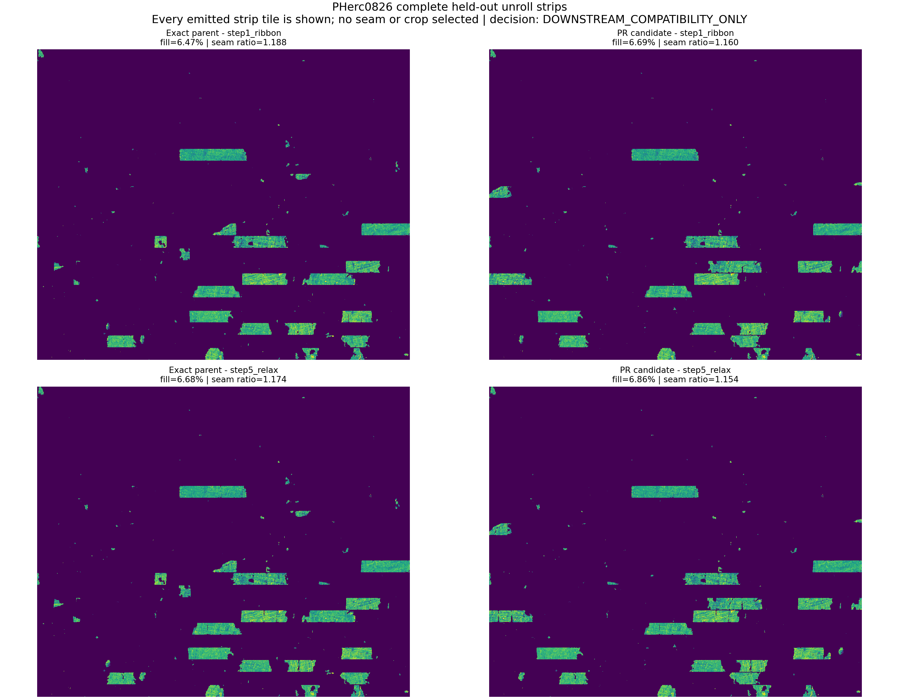

# PHerc0826 complete downstream texture result

Status: **`DOWNSTREAM_COMPATIBILITY_ONLY`** under the rules published in
commit `3ce0b8face0f3dff4db9dd88654786b4b7fc9555` before any downstream
output existed. All comparability, safety, and repeat-determinism gates passed,
but the preregistered downstream efficacy threshold did not.

This follow-up was run after the independent registration result was already
known. It is therefore a prospective downstream-survival test, not a second
independent efficacy test.

## Result

Both arms used the same 25 physical meshes, fixed RAW slab, executable, and
five-stage `scroll_unroll` command. They differed only in their registered
winding/UV sidecars.

| metric | exact parent | PR candidate | change |
|---|---:|---:|---:|
| stage-1 fill | 6.47% | 6.69% | +0.22 pp |
| stage-1 multi-cover | 48.14% | 43.02% | **-5.12 pp** |
| stage-1 seam discontinuity | 13.991 | 13.723 | -0.268 |
| stage-1 seam ratio | 1.188 | 1.160 | -0.028 |
| final fill | 6.68% | 6.86% | +0.18 pp |
| final multi-cover | 47.55% | 42.45% | **-5.10 pp** |
| final seam discontinuity | 13.657 | 13.201 | **-0.456** |
| final seam ratio | 1.174 | 1.154 | -0.020 |
| stage-1/final canvas area | 13,040,610 px | 13,040,610 px | exactly unchanged |

The canvas dimensions are exactly 101,090 x 129 pixels in both arms at both
reported stages; the machine result records an area ratio of exactly 1.0.

All safety gates passed: neither fill metric decreased, multi-cover decreased,
seam excess did not worsen, and the canvas stayed fixed. The efficacy rule
required stage-1 seam-excess reduction of at least 0.05 without an increase in
raw seam-column discontinuity. Discontinuity decreased, but seam excess fell
by only 0.028, so the frozen decision is compatibility-only rather than an
efficacy pass.

Every emitted stage-1 and stage-5 readable-strip tile is included in the
figure. No seam, crop, or favorable window was selected.

## Reproducibility and comparability

- All three runs exited zero with 25 cubes, 61,845 vertices, 61,802 faces,
  and the same five stage names.
- A fresh candidate repeat matched every non-timing metric and every required
  TIF/PNG artifact byte for byte.
- Each arm emitted nonempty uint8 raw-texture and diagnostic TIFs plus complete
  readable-strip and preview PNGs at every stage.
- The candidate and repeat used one thread and the exact frozen arguments;
  timing differences are excluded from the determinism contract.
- The compact result bundle contains the three pipeline-stat files, full
  process logs, machine decision with artifact hashes, and PNG/SVG figure.

## Important scope limitation

The fixed input is the held-out 1 x 5 x 5 PHerc0826 slab, not a full scroll.
The downstream consumer requested 122 neighboring RAW cubes outside that
local slab; those requests were absent identically in all arms. Consequently,
only 6.47-6.86% of the long winding canvas is textured and the complete figure
is visually sparse. This test establishes deterministic downstream
compatibility and favorable secondary texture metrics on the disclosed local
input. It does not establish full-scroll visual quality, ink recovery,
legibility, a new surface model, or the preregistered downstream efficacy
effect.

The independent claim remains the held-out registration improvement from
44/1,076 to 7/1,076 whole-turn errors. This result adds evidence that the
registration change survives the supported downstream pipeline without a
detected regression.
