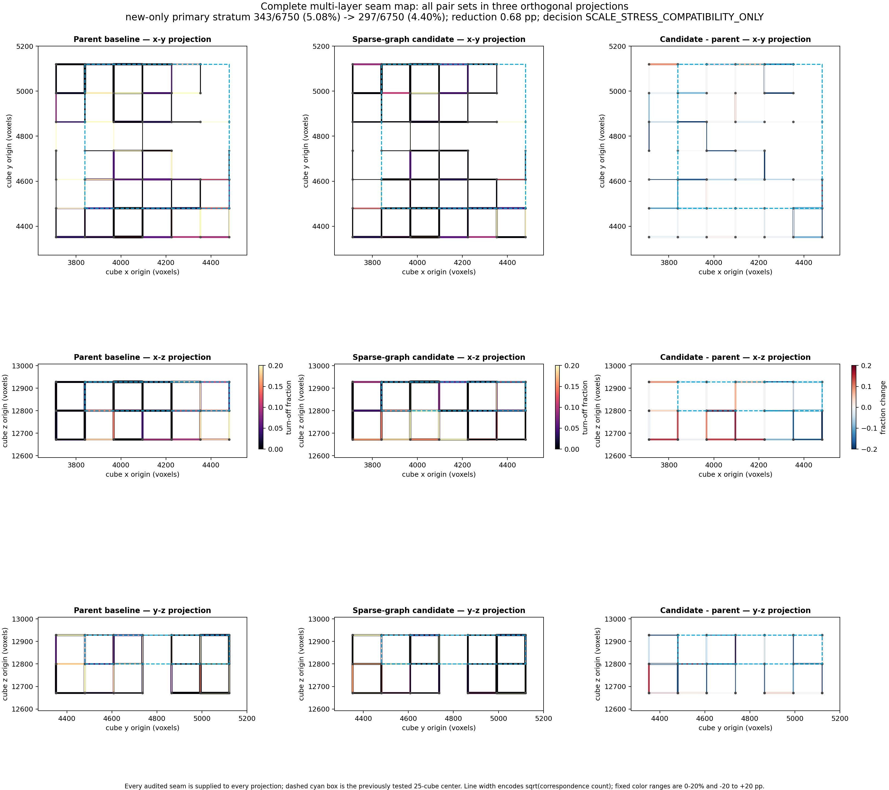
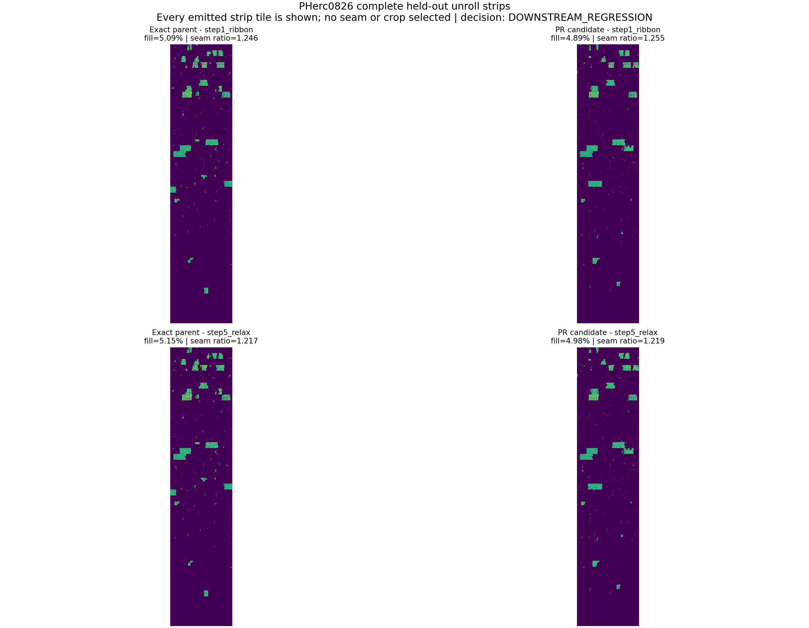

# PHerc0826 sparse-graph scale and complete-RAW result

Status: **`SCALE_STRESS_COMPATIBILITY_ONLY` for registration and
`DOWNSTREAM_REGRESSION` for the complete-RAW consumer**.

The protocol was pushed in commit
`7cd1264ed50e371fad899783f19ad3b801eddb7f` before any expanded-box voxel
access. It mechanically expanded the already known 25-cube PHerc0826 slab to
a 147-cube registered core with a complete 405-cube RAW halo. This is a
post-result scale stress test, not a second independent holdout.

## Registration result

All 147 cubes meshed successfully. The parent and candidate were compared on
the same 271 face-adjacent pair sets and 10,285 correspondences. Across the
complete core, the candidate improved every aggregate registration metric:

| complete-core metric | exact parent | PR candidate | change |
|---|---:|---:|---:|
| turn-off pairs | 534/10,285 (5.192%) | 371/10,285 (3.607%) | **-163, -1.585 pp** |
| `|du| < 2` | 76.90% | 78.82% | **+1.92 pp** |
| `|du| < 6` | 88.60% | 90.10% | +1.50 pp |
| collisions inside 5 voxels | 1,188 | 900 | **-288** |

However, the preregistered primary stratum excluded every seam touching the
previously tested 25-cube center. On those `new_only` seams the effect was
positive but below the frozen 1.00-point efficacy floor:

| frozen stratum | pair sets / pairs | parent | candidate | change | improved / worse / equal |
|---|---:|---:|---:|---:|---:|
| **new-only (primary)** | 178 / 6,750 | 343 (5.081%) | 297 (4.400%) | **-0.681 pp** | 67 / 18 / 93 |
| bridge | 63 / 2,512 | 156 (6.210%) | 62 (2.468%) | -3.742 pp | 27 / 1 / 35 |
| known center | 30 / 1,023 | 35 (3.421%) | 12 (1.173%) | -2.248 pp | 9 / 0 / 21 |

New-only collisions also improved, 723 to 626. The candidate passed the
built-in 5% gate overall and in the primary stratum, every safety and
comparability gate passed, and the fresh candidate repeat was byte-identical
for `audit.json`, `placed_index.json`, and all 147 registered skin sidecars.
The honest frozen decision is nevertheless compatibility-only: bridge and
known-center improvements cannot rescue the missed new-only efficacy floor.

The figure contains every audited seam in x-y, x-z, and y-z projection. The
known 25-cube box is outlined; no layer, seam, or favorable crop was selected.

## Complete-RAW downstream result

The parent, candidate, and fresh candidate repeat then ran the same frozen
five-stage `scroll_unroll` consumer against the complete 405-cube RAW halo.
Every arm prewarmed and loaded **405 RAW cubes with 0 missing**, eliminating
the earlier 122-neighbor limitation. All arms exited zero, and every required
candidate/repeat metric and TIF/PNG artifact matched exactly.

The candidate failed the frozen downstream safety gates:

| downstream metric | exact parent | PR candidate | change |
|---|---:|---:|---:|
| stage-1 fill | 5.09% | 4.89% | -0.20 pp |
| stage-1 multi-cover | 51.33% | 58.13% | **+6.80 pp** |
| stage-1 seam discontinuity | 12.970 | 12.679 | -0.291 |
| stage-1 seam ratio | 1.246 | 1.255 | +0.009 |
| final fill | 5.15% | 4.98% | -0.17 pp |
| final multi-cover | 50.96% | 57.78% | **+6.82 pp** |
| final seam discontinuity | 13.003 | 12.694 | -0.309 |
| final seam ratio | 1.217 | 1.219 | +0.002 |

The final multi-cover increase exceeds the preregistered +0.20-point safety
limit by a wide margin. Raw seam-column discontinuity improved, but normalized
seam ratio slightly worsened and cannot rescue a safety failure. The frozen
decision is `DOWNSTREAM_REGRESSION`.

The combined figure includes every emitted stage-1 and stage-5 strip tile.
The result bundle also publishes the six original full-resolution
parent/candidate/repeat strip PNGs. Visual inspection does not establish a
cleaner candidate strip and agrees with the quantitative decision.

## Input, mesh, and repeat verification

- exactly 405 prediction and 405 RAW halo TIFFs were carved and validated;
- all 810 TIFFs were uint8 `128^3`; prediction values were binary 0/255;
- all 405 prediction and RAW cubes were nonempty;
- the fixed core contained all 147 prediction cubes and the complete known
  25-cube center;
- input-row canonical SHA-256:
  `47e4a0e5bf12d7f3858852f9460b3500881c844960d7387b03bd4375d0cd122b`;
- `grid_pipeline` processed 147/147 cubes with exit zero, zero rejects, and
  zero failures in 4,556.5 seconds;
- all 147 exact `step12_final` OBJ paths were present and nonempty, and each
  matched its `_all_obj` mirror byte for byte;
- mesh validation SHA-256:
  `60bf37c8a07741baf4ffb6dcd25dab8e55c2f7a427f50778bd9fa331d450c785`;
- registration result SHA-256:
  `9fe694eddaacb8314e7a39159f7dd773d4c785701320fedc2f6ada7a9eda7133`;
- downstream result SHA-256:
  `63f12c56d8d04aa0b1c2f3b50897b79ec22bbcddb1683e923542ef0df24ff175`.

PowerShell classified the native mesher's stderr status stream as a
`NativeCommandError` after it completed, but the native final summary, the
147-row CSV, exact final-OBJ inventory, and empty reject file all independently
agree on 147 successes. The mesher was not rerun.

## Comparator schema erratum

The first frozen comparator call stopped before producing any stratum result
or figure because the inherited parser incorrectly required per-seam
`collide <= n`. Native source shows these counts use different radii:
`collide` uses the fixed 5-voxel collision gate, while `n` uses the configured
3.5-voxel pair gate, so the wider-gate count may legitimately be larger.

The minimal parser correction, regression test, exact failed-input hashes, and
absence of any pre-correction result are documented in the
[public erratum](PHERC0826_SCALE_COMPARATOR_SCHEMA_ERRATUM.md), pushed in
commit `a19325506a04c0a7469f41722413ff7f78a02331` before the corrected call.
No input, stratum, threshold, metric, or decision rule changed.

## Interpretation

The sparse graph guard still has strong stage-local evidence: an independent
25-cube efficacy pass and a positive, safe registration effect across the
larger 147-cube core. But the new-only effect did not replicate at the frozen
minimum magnitude, and the full downstream consumer regressed substantially
in multi-cover. This evidence does **not** support merging the behavior as an
unconditional default.

The next technically justified step is to diagnose which accepted sparse
relations create duplicate coverage, then design an opt-in or prospectively
gated variant and test it on a newly frozen region. The current scale result
must remain attached to this exact candidate; it may not be reframed as a
scale efficacy pass or a downstream improvement.

The compact registration bundle contains all audits, indices, reregistration
logs, input/mesh validations, complete machine result, and PNG/SVG seam map.
The downstream bundle contains all pipeline stats and logs, exact machine
decision, complete PNG/SVG comparison, and full-resolution strips. Both
include per-file byte/SHA-256 manifests.
