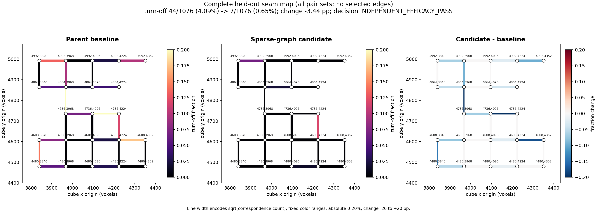

# PHerc0826 held-out sparse-graph winding result

Status: **independent efficacy pass** on the protocol frozen and pushed before
access to the selected slab. The tested change is candidate
`a47a21c3a9d445c90d28e218b8f0fcbecd49c079` against its exact parent
`e0cf51cab03f6fe84e43e8c7ff5be9051d951b1d`.

**Larger-scale follow-up:** a preregistered 147-cube stress test found a
positive but sub-threshold effect on seams wholly outside this known center
(`5.081% -> 4.400%`, -0.681 point versus a frozen -1.00-point floor), followed
by a complete-RAW downstream regression in multi-cover (`50.96% -> 57.78%`).
The exact candidate is therefore **not supported as an unconditional default**
despite this valid small-slab efficacy result. See the
[scale result](PHERC0826_SPARSE_GRAPH_SCALE_STRESS_RESULT.md).

The parent and candidate were run on the same 25 meshes and audited on the
same 29 adjacent pair sets containing 1,076 correspondences. Preserving
sparse observed winding constraints reduced whole-turn seam errors from
44/1,076 to 7/1,076:

| frozen metric | parent | candidate | change | gate |
|---|---:|---:|---:|---:|
| turn-off pairs | 44 (4.089%) | 7 (0.651%) | **-37, -3.439 pp (-84.1%)** | at least -1.00 pp |
| `|du| < 2` | 86.25% | 89.78% | **+3.53 pp** | no worse than -0.50 pp |
| `|du| < 6` | 93.31% | 96.75% | +3.44 pp | descriptive |
| collisions below 5 voxels | 96 | 30 | **-66** | nonincreasing |

Fifteen pair sets improved, none worsened, and fourteen were unchanged. Both
arms passed the built-in quality gate. The candidate's 0.651% turn-off rate is
also below the frozen 5% ceiling.

The figure renders every audited pair set with fixed color scales; no edge was
selected or hidden. The SVG version and machine-readable per-edge table are in
the result bundle.

## Complete downstream texture check

A separately preregistered five-stage `scroll_unroll` comparison passed every
comparability, safety, and repeat-determinism gate. Relative to the exact
parent, the candidate reduced final multi-cover from 47.55% to 42.45%, reduced
final seam-column discontinuity from 13.657 to 13.201, and increased fill from
6.68% to 6.86% on an identical canvas. It did **not** meet the stricter frozen
downstream efficacy rule: stage-1 seam excess fell by 0.028 versus the required
0.05. The honest decision is therefore `DOWNSTREAM_COMPATIBILITY_ONLY`.

The [complete downstream report](PHERC0826_SPARSE_GRAPH_DOWNSTREAM_RESULT.md)
and its uncropped full-strip figure disclose the local-slab sparsity and all
other scope limits. This follow-up supports absence of a detected downstream
regression; it is not counted as a second independent efficacy result.

## What changed

The exact parent already shared the multi-seed pitch selector and consensus
component gauge. Only the registered sparse-graph behavior differs:

1. an observed group-pair bucket is admitted from one correspondence rather
   than requiring three;
2. groups supported by an admitted graph edge are recorded; and
3. polish preserves the integer winding and matching residual shift of those
   graph-supported groups while continuing to polish graph-isolated groups.

On this held-out slab the candidate admitted 164 graph edges instead of 123,
reduced graph components from 229 to 198, and preserved 16 graph-supported
polish proposals. This is the mechanism predicted by the development
diagnosis, not a pitch, sign, data, or audit change.

## Frozen design and comparability

The [preregistration](PHERC0826_SPARSE_GRAPH_WINDING_VALIDATION_PREREG.md) was
published in commit `4ea1c89a9fed1e8d78d5f66f9a773a313c2e32d6` before selected-slab voxel
access. A metadata-only rule selected the PHerc0826 box
`[12800,12928) x [4480,5120) x [3840,4480)` in z/y/x, a 1 x 5 x 5 grid of
128-cubed cubes. The conservative prior-access reconstruction is published
separately and the nearest disclosed earlier request is 348 z voxels away.

Input and mesh gates passed:

- 25 prediction and 25 RAW cubes, with exact source, box, dtype, value, voxel
  count, and per-file hash checks;
- all 25 mesh jobs exited zero, the reject file stayed empty, and all 25 final
  directories contained nonempty OBJ output (773 components total);
- both arms shared initial calibration, cube geometry, statuses, pair keys,
  and per-key pair counts;
- both final indices contained 25 OK, zero skipped, and zero low-confidence
  inputs; and
- pitch 6.485687 vox/turn, sign -1, and all initial calibration fields matched.

The candidate was then rerun from the same mesh dump. `audit.json` and
`placed_index.json` were byte-identical, and all 25 registered `_skin.f32`
files matched byte for byte. The sorted skin-hash manifest SHA-256 was
`ae59bfa798fb9e38cf73bbd211c6291350174e4d81e63c87fca5a3ba97844ea2`
in both runs.

## Reproduction evidence

The compact bundle under
`docs/results/pherc0826_sparse_graph_holdout_20260810/` contains:

- the carved-input validation with all 50 TIFF hashes and source metadata;
- the 25-row mesh summary;
- both audits and placed indices plus the fresh candidate repeat;
- reregistration logs exposing graph and polish diagnostics;
- `paired_result.json`, including all 29 per-pair rows and frozen gate
  decisions; and
- complete PNG and SVG seam maps.

The separate compact downstream bundle under
`docs/results/pherc0826_sparse_graph_downstream_20260810/` contains the frozen
machine decision, all three pipeline-stat files, full process logs, and the
complete PNG/SVG strip comparison.

The exact execution commands and thresholds are in the preregistration. After
the result, the non-network Python suite completed with 58 passed, one
environment-dependent skip, and four network tests deselected. The frozen
comparator's three focused tests are included in that run.

## Related winding-constraint work

[`abundantjoe/winding-sync`](https://github.com/abundantjoe/winding-sync) is
adjacent but operates at a different layer: it generates relative winding
constraints directly from CT and reconciles its node graph with global L1
integer synchronization. This change neither generates those annotations nor
reimplements that solver. It consumes ScrollFiesta's existing cross-cube mesh
seam correspondences, admits sparse group-pair observations after the existing
geometry/phase gates, and prevents the later local polish from overwriting
accepted relations. The two approaches are complementary; no code or artifact
from `winding-sync` is used here.

## Scope

This is strong held-out evidence for the sparse cross-cube winding change, but
it is one independently selected 1 x 5 x 5 slab on one separate scroll. It
measures cross-cube registration consistency of the published m7 surface; it
does not by itself measure full-scroll tracing, surface-model accuracy, or ink
recovery. PHerc0826 has prior public work, and the preregistration explicitly
bounds the claim to this disclosed slab and algorithmic comparison.
