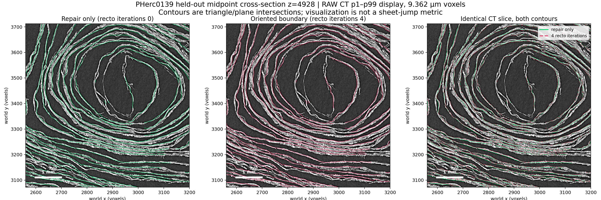

# PHerc0139 snap-to-ridge ablation

This experiment answers one narrow question: when a surface is meant to stay
centred on the CT intensity ridge, should ScrollFiesta's optional global
recto-boundary refinement run after dark-region repair?

It does **not** claim that the oriented recto edge is physically wrong. The two
targets differ: the ridge is the intensity maximum; the recto objective is the
outward dark-to-bright boundary. Workflows that require the latter can opt in
with `--snap-recto-iters 4`.

## Data and frozen protocol

The real-data fixture is the aligned PHerc0139 4x5x5 block at z
`[4352,4864)`, y `[3072,3712)`, x `[2560,3200)`:

- RAW CT: `s3://vesuvius-challenge-open-data/PHerc0139/volumes/20250728140407-9.362um-1.2m-113keV-masked.zarr`
- surface prediction: `s3://vesuvius-challenge-open-data/PHerc0139/representations/predictions/surfaces/20250728140407-surface-20260413222639-surface-m7-L0-th0.2.zarr`

The 100 RAW and 100 prediction cubes are uint8 128-cube TIFFs. The decoded
first RAW TIFF was byte-identical to S3 chunk `0/34/24/20` (MD5/ETag
`76ec6610bd726589a1b74dcd27acbda4`). Placement processed all 100 cubes; its
independent audit passed with 6,441 adjacent pairs, 2.903% turn-off (5% limit),
and 82.86% at |du| < 2 (50% floor).

The split and metric were frozen before any arm ran:

- development: z origins 4352, 4480, 4608 (75 cubes);
- held-out test: z origin 4736 (25 cubes), read once after selection;
- arms: recto iterations 0, 1, 2, 4 at range 3; all other arguments fixed;
- score: median absolute offset to the sigma-1-smoothed CT ridge, sampled over
  +/-4 voxels at 0.25-voxel spacing with parabolic peak refinement;
- the pre-snap mesh normal is fixed for every arm, preventing an arm from
  improving its score by rotating the sampling axis;
- cube is the inferential unit; paired bootstrap uses 10,000 resamples and seed
  20260808;
- required held-out improvement over the previous 4-iteration default: at
  least 0.05 voxel with the paired 95% interval excluding zero.

Every arm preserved exactly 113,112 vertices, 191,889 faces, face indices,
registered UVs, and cube vertex ranges. Fill stayed 0.2269, multi-coverage
0.2845, seam ratio 1.003-1.008, and v-seam ratio 1.137-1.150.

## Results

| arm | development median | held-out median |
|---|---:|---:|
| pre-snap stage 2 | 1.7101 | 1.6297 |
| repair only, recto iterations 0 | **1.4465** | **1.4648** |
| recto iterations 1 | 1.8337 | not used for selection test |
| recto iterations 2 | 2.0586 | not used for selection test |
| previous default, recto iterations 4 | 2.2408 | 2.1664 |

On development, repair-only improved over four iterations by 0.7608 voxel
(paired bootstrap 95% CI `[0.7191, 0.7945]`) and won all 75/75 cubes. It was
therefore frozen without a range sweep. On the untouched 25-cube band, the
improvement was 0.7462 voxel (`[0.6915, 0.7946]`) and all 25/25 cubes improved;
the smallest per-cube improvement was 0.4347 voxel.

The complete per-cube outputs are committed as
[`results/pherc0139_snap_dev.json`](results/pherc0139_snap_dev.json) and
[`results/pherc0139_snap_test.json`](results/pherc0139_snap_test.json). Their
SHA-256 digests are respectively
`495b6cbbafd744aa628a253ed91b77cdb43692fc25b750fc09222e285e6bbd1a` and
`157d240f09ae26aedb87c2089000ffb05555aed3fa38c020e2df900e1e057916`.

## Untouched adjacent-slab replication

The same fixed comparison was then run without tuning on the first 128-voxel
slab immediately after the published block: z `[4864,4992)`, with the same
y/x footprint. The region and success gates were frozen locally before any of
its chunks were read; the complete preregistration and build receipt has
SHA-256
`a4017d5a40f7b43555df3872d7279f97a5b089fd8120d385154acf30a88b9e3b`.
The full frozen text is
[`PHERC0139_ADJACENT_SLAB_REPLICATION_PREREG.md`](PHERC0139_ADJACENT_SLAB_REPLICATION_PREREG.md).
This is a spatial replication on PHerc0139, not a cross-scroll claim.

All 25 prediction and 25 RAW cubes validated as matching uint8 128-cubes.
Exact-head meshing succeeded 25/25. After reregistration, placement retained
25/25 with zero skipped or low-confidence cubes; its independent audit found
3.418% turn-off and 87.30% at |du| < 2. The welded mesh had zero non-manifold
edges and zero pinch vertices.

| arm | adjacent-slab median ridge offset |
|---|---:|
| pre-snap stage 2 | 1.6742 |
| repair only, recto iterations 0 | **1.4593** |
| previous default, recto iterations 4 | 2.1756 |

Repair-only improved over four iterations by 0.7034 voxel (paired bootstrap
95% CI `[0.6604, 0.7826]`) and won all 25/25 cubes; the smallest per-cube
improvement was 0.4694 voxel. The paired calculation used 15,971 common
bracketed vertices. Both arms retained identical topology, UVs, cube ranges,
32,516 vertices, and 51,209 faces. An independent score rerun was byte-identical,
and the no-flag default OBJ was byte-identical to explicit iteration 0.

The complete result is committed as
[`results/pherc0139_snap_adjacent_replication.json`](results/pherc0139_snap_adjacent_replication.json),
SHA-256
`b42ab7e2bac747f628fdacc174dac622cbcef8b8c436e22115f74c76a483e3df`.
The fixed midpoint z=4928 image below shows both contours following visible
layers without an obvious cross-sheet jump. It is a qualitative check only.



The PNG SHA-256 is
`7d207a53b500e8081687fe24cb6b6b90cbd6641a39c7da9262b7727e1ba176d5`.

## Qualitative checks

The fixed held-out-band midpoint, z=4800, was chosen without searching slices.
The following plot assembles all 25 RAW tiles at that z and intersects both
shared-topology meshes with the same plane. Both contours visibly follow the
papyrus layers without an obvious cross-sheet jump in this slice. This is a
qualitative check, not a validated sheet-jump metric.


The texture crop below was selected without looking at either stage-4 arm. A
fixed 768-pixel window scans the common stage-2 RAW texture every 256 pixels;
windows need at least 90% coverage and are ranked by a disclosed combination of
coverage, local structure-tensor coherence, and robust gradient energy. The two
stage-2 TIFFs were byte-identical. The winning window was `[35328,36096)` with
97.72% coverage. Fine coherent papyrus-fiber striations are visible in both
stage-4 outputs. The panel does not claim that fiber visibility is better in
one arm or that either image establishes text legibility.


The two PNG SHA-256 digests are respectively
`d3a255296d20a8837cd91f589251aabf218553848595afaf5db255e103b64244`
and `b2e138e6a451117e7ca2e0cdf1f2dbb084da9f376f1670ef0c4a7a7cd1952001`.

## Reproduce

Carve the aligned fixture using the repository's existing Zarr-to-grid tool:

```text
py -m uv run --project python python/scripts/carve_grid_tifs.py \
  --pred-zarr s3://vesuvius-challenge-open-data/PHerc0139/representations/predictions/surfaces/20250728140407-surface-20260413222639-surface-m7-L0-th0.2.zarr \
  --raw-zarr s3://vesuvius-challenge-open-data/PHerc0139/volumes/20250728140407-9.362um-1.2m-113keV-masked.zarr \
  --bbox 4352 4864 3072 3712 2560 3200 \
  --umbilicus 3405 2878 --out data/PHerc0139-4x5x5
```

Run the normal `grid_pipeline` and audited `scroll_whole` workflow, then export
the exact shared-index PieceSet from stage 2 and each stage-4 arm. For example:

```text
build/Release/scroll_unroll PLACED OUT/iter0 --raw GRID/cubes_RAW \
  --steps 124 --id iter0_r3 --snap-recto-iters 0 --snap-recto-range 3 \
  --no-preview --no-xyzmap --export-mesh OUT/iter0/iter0.obj
```

Prepare the fixed CT cache, score development, name the candidate, and only
then reveal the locked test band:

```text
py -m uv run --project python python/scripts/score_snap_ridge.py prepare \
  --raw-dir GRID/cubes_RAW --cache GRID/ct_sigma1.npy

py -m uv run --project python python/scripts/score_snap_ridge.py score \
  --split dev --pre OUT/pre.obj \
  --arm iter0_r3=OUT/iter0.obj --arm iter1_r3=OUT/iter1.obj \
  --arm iter2_r3=OUT/iter2.obj --arm iter4_r3=OUT/iter4.obj \
  --production iter4_r3 --cache GRID/ct_sigma1.npy --out dev.json

py -m uv run --project python python/scripts/score_snap_ridge.py score \
  --split test --pre OUT/pre.obj --arm iter0_r3=OUT/iter0.obj \
  --arm iter4_r3=OUT/iter4.obj --production iter4_r3 \
  --candidate iter0_r3 --cache GRID/ct_sigma1.npy --out test.json
```

For the frozen adjacent slab, prepare and score the explicit grid geometry:

```text
py -m uv run --project python python/scripts/score_snap_ridge.py prepare \
  --raw-dir ADJACENT_GRID/cubes_RAW --cache ADJACENT_GRID/ct_sigma1.npy \
  --origin 4864 3072 2560 --shape 128 640 640

py -m uv run --project python python/scripts/score_snap_ridge.py score \
  --split replication --pre ADJACENT_OUT/pre.obj \
  --arm iter0_r3=ADJACENT_OUT/iter0.obj \
  --arm iter4_r3=ADJACENT_OUT/iter4.obj --production iter4_r3 \
  --candidate iter0_r3 --cache ADJACENT_GRID/ct_sigma1.npy \
  --origin 4864 3072 2560 --shape 128 640 640 --z-origins 4864 \
  --out adjacent_replication.json
```

The scorer verifies the CT-cache digest and refuses changed topology, face
indices, UVs, cube ranges, duplicate arm names, or an unnamed test candidate.

Reproduce the qualitative figures from the same exported meshes and normal
stage-2/stage-4 RAW texture outputs:

```text
py -m uv run --project python python/scripts/plot_snap_cross_section.py \
  --raw-dir GRID/cubes_RAW --repair-obj OUT/iter0.obj \
  --recto-obj OUT/iter4.obj --z 4800 \
  --out docs/images/pherc0139_snap_cross_section_z4800.png

py -m uv run --project python python/scripts/select_fiber_texture_crop.py \
  --common-pre OUT/iter0/iter0_r3_step2_join_rawtex.tif \
  --repair OUT/iter0/iter0_r3_step4_snap_rawtex.tif \
  --recto OUT/iter4/iter4_r3_step4_snap_rawtex.tif \
  --out docs/images/pherc0139_snap_high_structure_texture.png
```

## Decision

Dark-region repair remains the default stage-4 geometry change. The distinct,
still-experimental recto-boundary refinement is retained but opt-in. This is a
conservative default change supported by real data, not a claim that a ridge
and a recto boundary are interchangeable.
